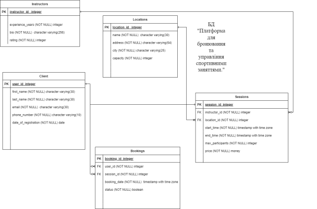

# Створення додатку бази даних, орієнтованого на взаємодію з СУБД PostgreSQL

### Структура бази даних
# 

## Список опису функцій моделі "Model"
1. [Model](#1)
2. [CloseConnection](#2)
3. [AddDataToTableModel](#3)
4. [GetColumnTypes](#4)
5. [GetPrimaryKeyColumn](#5)
6. [GetConvertedValues](#6)
7. [UpdateDataInTable](#7)
8. [GetColumnNameOfTable](#8)
9. [GetRowsOfTable](#9)
10. [GetAllTables](#10)
11. [DeleteDataOfTable](#11)
12. [GenerateDataToCurrentTable](#12)
13. [SearchFirst](#13)
14. [SearchSecond](#14)
15. [SearchThird](#15)

### <a id="1">1.Model()</a>
#### Конструктор класу Model, який ініціалізує підключення до бази даних.
### <a id="2">2.CloseConnection()</a>
#### Метод классу Model, який закриває з'єднання з базою даних, перевіряючи чи створено підключення та відкрито воно.
### <a id="3">3.AddDataToTableModel(List<(string Column, string Value)> values,string table_name)</a>
#### Метод классу Model, який додає нові дані введені користувачем в відповідну таблицю, приймає як параметри список кортежій з назви атрибута та самого значення, а також ім'я таблиці.
### <a id="4">4.GetColumnTypes(string tableName)</a>
#### Метод класу Model, який отримує з information_schema типи атрибутів таблиці, ім'я якої передається в якості параметру метода, повертає словник з ключ:назва атрибуту, значення:тип.
### <a id="5">5.GetPrimaryKeyColumn(string table_name)</a>
#### Метод класу Model, який отримує з information_schema назву атрибута таблиці, який є primary key.
### <a id="6">6.GetConvertedValues(Dictionary<string, string> columnTypes, string column, string value)</a>
#### Метод класу Model, який конвертує значення введені користувачем в типи для внесення в базу даних.Приймає в якості параметрів: словник назв атрибутів і їх типів, назву атрибуту і значення(string),яке треба конвертувати.
### <a id="7">7.UpdateDataInTable(List<(string Column, string Value)> values_res, string table_name, int pk)</a>
#### Метод класу Model, який оновлює дані відповідного по *pk* запис обраної таблиці. Параметри: список кортежій з назв атрибутів та значеннями новими, назва таблиці, первинний ключ.
### <a id="8">8.GetColumnNameOfTable(string table_name)</a>
#### Метод класу Model, який отримує назви атрибутів відповідної таблиці з information_schema.
### <a id="9">9.GetRowsOfTable(string table_name, int page_num)</a>
#### Метод класу Model, який отримує записи посторінково(50 записів) з відповідної таблиці, для виводу.Параметри:назва таблиці, номер сторінки.
### <a id="10">10.GetAllTables()</a>
#### Метод класу Model, який отримує назви всіх таблиць в базі даних з information_schema.
### <a id="11">11.DeleteDataOfTable(string table_name, int pk, string pk_str)</a>
#### Метод класу Model, який видаляє відповідний запис з таблиці по *pk*.Параметри: назва таблиці, значення *pk*,назва атрибуту,який є *pk*. 
### <a id="12">12.GenerateDataToCurrentTable(string proc_name, int count_rows)</a>
#### Метод класу Model, який запускає процедуру для генерації рандномних записів в таблиці.Параметри: назва процедури, кількість записів для формування.
### <a id="13">13.SearchFirst(string status)</a>
#### Метод класу Model, який здійснює перший SQL-запит для пошуку.Параметр: статус бронювання, за яким групується пошук(true or false).
### <a id="14">14.SearchSecond(string start_time)</a>
#### Метод класу Model, який здійснює другий SQL-запит для пошуку. Параметр: час(початок тренувань) по якому здійснюється пошук.
### <a id="15">15.SearchThird(string city, string exp_years)</a>
#### Метод класу Model, який здійснює третій SQL-запит для пошуку. Параметр: назва міста, кількість досвіду роботи тренером.

